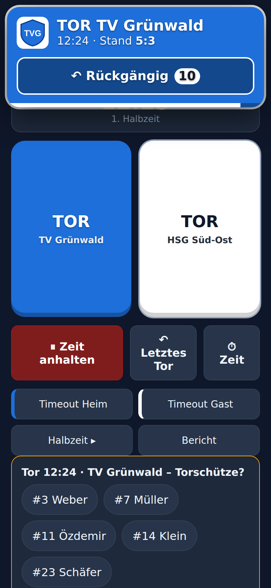
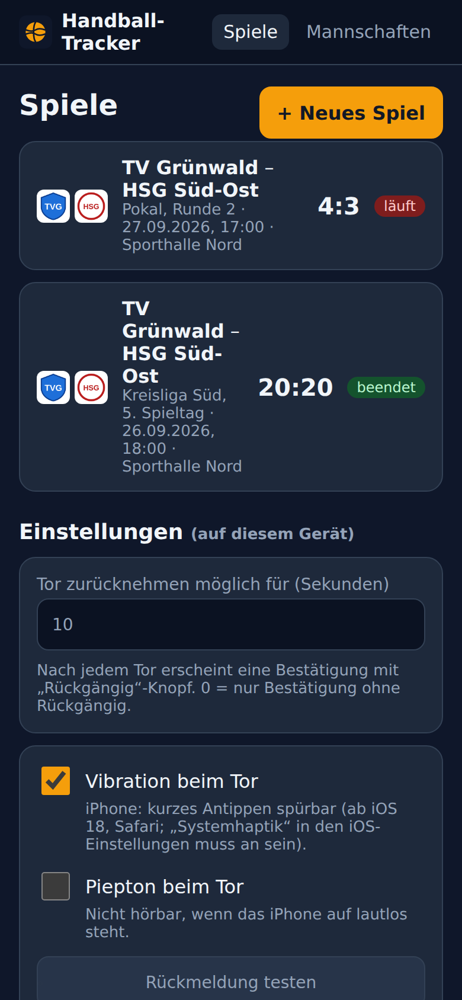
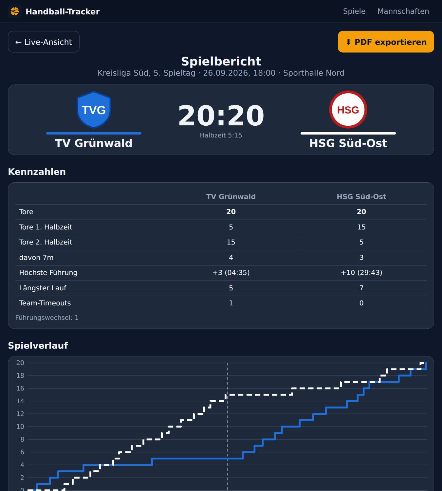

<div align="center">


# Handball-Tracker

**Tore live mitzählen – mit synchroner Spieluhr, Tor-Bestätigung, Vibration und Spielbericht als PDF.**

Eine Web-App fürs Handy am Spielfeldrand: zwei große TOR-Tasten, eine Uhr, die mit der Hallenuhr läuft,
und am Ende ein fertiger Spielbericht mit Verlaufsdiagramm, Torschützen und Kennzahlen.

[Bedienung](docs/BEDIENUNG.md) · [API](docs/API.md) · [Betrieb & Deployment](docs/BETRIEB.md)

</div>

---

<table>
<tr>
<td align="center" width="33%"><br><sub><b>Live-Erfassung</b><br>Zwei große TOR-Tasten in Teamfarben</sub></td>
<td align="center" width="33%"><br><sub><b>Tor-Bestätigung</b><br>Banner, Vibration, 10 s Rückgängig</sub></td>
<td align="center" width="33%"><br><sub><b>Spieleübersicht</b><br>mit Logos, Stand und Status</sub></td>
</tr>
</table>

<p align="center">
&nbsp;

</p>

## Was die App kann

| | |
|---|---|
| 🏐 **Zwei große TOR-Tasten** | Ein Tipp = ein Tor, mit Spielzeit gespeichert. Doppeltipp-Schutz inklusive. |
| ✅ **Tor-Bestätigung** | Großes Banner in Teamfarbe mit Logo, Zeit und neuem Stand – plus **„Rückgängig“ mit Countdown** (Dauer einstellbar). |
| 📳 **Vibration** | Spürbares Feedback beim Tor – auf Android *und* iPhone (iOS 18+). Optional Piepton. |
| ⏱️ **Synchrone Spieluhr** | Anpfiff / Anhalten / Weiter, Angleichen an die Hallenuhr (±1 s, ±10 s oder mm:ss). Stoppt automatisch am Halbzeitende, Team-Timeout hält sie an. |
| 📱 **Mehrere Geräte** | Die Uhr läuft auf dem Server. Alle Handys/Tablets zeigen live denselben Stand. |
| 👕 **Mannschaften** | Name, Kürzel, Trikotfarbe, **Logo-Upload** und optional Kader mit Rückennummern. |
| 🎯 **Torschützen & 7m** | Nach jedem Tor Spieler antippen – optional, jederzeit nachträglich korrigierbar. |
| 📊 **Spielbericht** | Ergebnis, Halbzeitstand, Verlaufsdiagramm, Tore je 5 Minuten, Torschützen, Torfolge, Timeouts, höchste Führung, längster Lauf, Führungswechsel, Notizen. |
| 📄 **PDF-Export** | Ein Klick – fertiger Bericht zum Weiterleiten oder Ausdrucken, mit Logos. |
| 🛡️ **Robust** | Rücknahme wiederholt sich bei Netz-/Server-Aussetzern automatisch, Live-Sync verbindet sich selbst neu. |

## Spieltag in 5 Schritten

1. **Mannschaften anlegen** – *Mannschaften* → Name, Farbe, Logo (einmalig).
2. **Spiel anlegen** – *Spiele* → *+ Neues Spiel* → Heim, Gast, Liga, Halle, Halbzeitlänge.
3. **Anpfiff drücken**, sobald die Hallenuhr startet. Bei Unterbrechungen *Zeit anhalten* / *Zeit weiter*.
4. **Tore tippen.** Banner + Vibration bestätigen. Vertippt? Innerhalb von 10 s *Rückgängig*.
5. **Spiel beenden** → Spielbericht erscheint → *PDF exportieren*.

➡️ Ausführlich mit Tipps für die Halle: **[docs/BEDIENUNG.md](docs/BEDIENUNG.md)**

## Technik in Kürze

- **Backend:** Python 3.12, [FastAPI](https://fastapi.tiangolo.com/), SQLite (eine Datei, `/data/handball.db`)
- **PDF:** [ReportLab](https://www.reportlab.com/) – Diagramm und Tabellen werden serverseitig gezeichnet
- **Frontend:** Vanilla JS + CSS ohne Build-Schritt, als Web-App auf den Home-Bildschirm legbar
- **Live-Sync:** Server-Sent Events, Uhr serverseitig mit Zeitabgleich pro Gerät
- **Betrieb:** Docker-Image über GitHub Actions nach `ghcr.io/mbay-odw/handball-tracker`, Portainer-Stack hinter Traefik + Authelia

```
app/
├── main.py        # FastAPI: REST-API, Spieluhr, Live-Stream (SSE)
├── db.py          # SQLite-Schema + Migrationen
├── report.py      # Auswertung für den Bericht (Kennzahlen, Verlauf, Intervalle)
├── pdf.py         # PDF-Spielbericht (ReportLab)
└── static/        # Web-App: index.html, app.js, style.css, Icon, Manifest
```

## Lokal starten

```bash
pip install -r requirements.txt
DATA_DIR=./data uvicorn app.main:app --reload
# → http://localhost:8000
```

oder mit Docker:

```bash
docker build -t handball-tracker .
docker run -p 8000:8000 -v "$PWD/data:/data" handball-tracker
```

## Weiterlesen

| Dokument | Inhalt |
|---|---|
| [docs/BEDIENUNG.md](docs/BEDIENUNG.md) | Anleitung für den Spieltag, Uhr-Logik, iPhone-Tipps, FAQ |
| [docs/API.md](docs/API.md) | Alle REST-Endpunkte mit Beispielen, Datenmodell, Live-Stream |
| [docs/BETRIEB.md](docs/BETRIEB.md) | Deployment (Portainer/Traefik/Authelia), Updates, Backup, Rollback, Fehlersuche |
