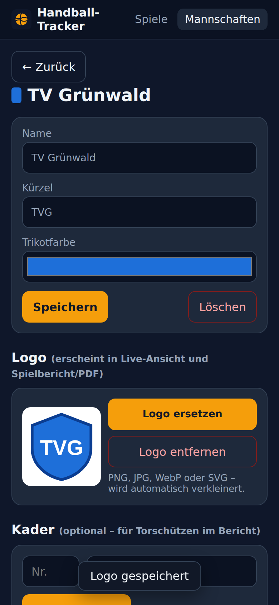
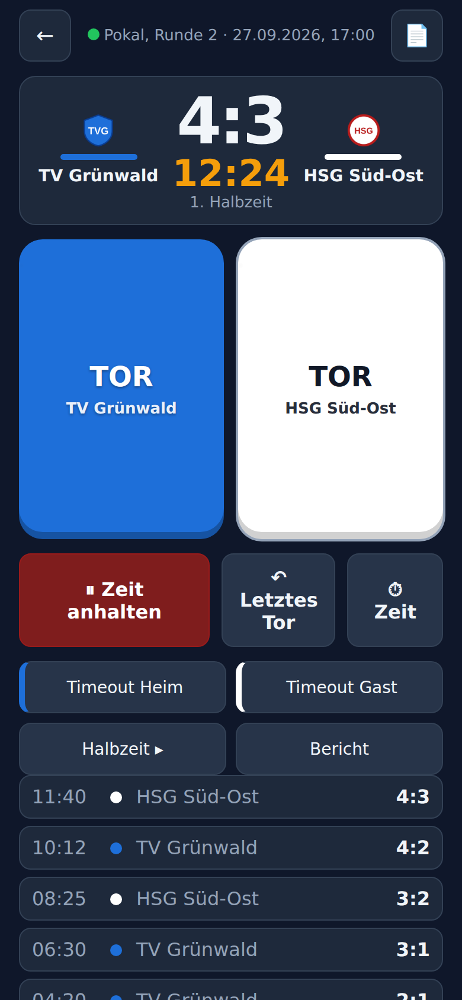
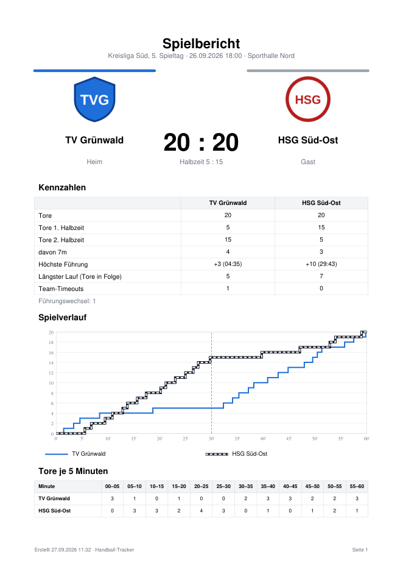

# Bedienung

Alles, was man am Spieltag braucht – vom Anlegen der Mannschaften bis zum PDF.

**Adresse:** https://handball.bay-ram.de (Anmeldung über Authelia)

- [1. Vorbereitung (einmalig)](#1-vorbereitung-einmalig)
- [2. Spiel anlegen](#2-spiel-anlegen)
- [3. Live-Erfassung](#3-live-erfassung)
- [4. Die Spieluhr](#4-die-spieluhr)
- [5. Halbzeit, Spielende, Korrekturen](#5-halbzeit-spielende-korrekturen)
- [6. Spielbericht & PDF](#6-spielbericht--pdf)
- [7. Einstellungen pro Gerät](#7-einstellungen-pro-gerät)
- [8. Tipps fürs iPhone](#8-tipps-fürs-iphone)
- [9. FAQ & Probleme](#9-faq--probleme)

---

## 1. Vorbereitung (einmalig)

### App auf den Home-Bildschirm legen

Dann startet sie im Vollbild wie eine echte App – ohne Adressleiste.

- **iPhone (Safari):** Teilen-Symbol → *Zum Home-Bildschirm*
- **Android (Chrome):** Menü ⋮ → *Zum Startbildschirm hinzufügen*

### Mannschaften anlegen

1. Oben **Mannschaften** antippen.
2. Unten bei *Neue Mannschaft*: **Name**, **Kürzel** (optional) und **Trikotfarbe** eintragen → *Mannschaft anlegen*.
3. Du landest direkt auf der Mannschaftsseite:
   - **Logo** → *Logo hochladen* (PNG, JPG, WebP oder SVG – direkt aus Fotos/Dateien). Das Bild wird automatisch verkleinert.
   - **Kader** (optional) → Nummer + Name → *+ Hinzufügen*. Nur nötig, wenn im Bericht Torschützen stehen sollen.

> **Tipp:** Logo und Farbe *vor* dem Anlegen eines Spiels setzen – jedes Spiel merkt sich beim Anlegen Namen, Farbe und Logo.
> So bleiben alte Berichte unverändert, auch wenn sich später etwas ändert.

> **Weiße oder sehr helle Trikots** sind kein Problem: TOR-Taste und Banner bekommen dann dunkle Schrift,
> und im Diagramm erhält die Linie einen dunklen Rand.

 

## 2. Spiel anlegen

*Spiele* → **+ Neues Spiel**

| Feld | Hinweis |
|---|---|
| Heim / Gast | aus den angelegten Mannschaften |
| Wettbewerb / Liga | z. B. „Kreisliga Süd, 5. Spieltag“ – erscheint im Bericht |
| Datum & Anstoß | vorbelegt mit jetzt |
| Halle / Ort | optional |
| Minuten je Halbzeit | Standard 30 – Jugend oft 25 oder 20 |
| Anzahl Halbzeiten | Standard 2 |

→ *Spiel anlegen & zur Live-Erfassung*

## 3. Live-Erfassung

Oben die **Anzeigetafel** (Logos, Stand, Spielzeit), darunter die **zwei großen TOR-Tasten** in den Teamfarben.

**Tor erfassen:** Einfach auf die Taste der Mannschaft tippen. Dann passiert dreierlei:

1. 📳 **Vibration** (einmal kurz) – du spürst, dass der Tipp angekommen ist.
2. ✅ **Banner** oben in Teamfarbe: *„TOR TV Grünwald · 12:24 · Stand 5:3“*.
3. ↶ **Rückgängig mit Countdown** (Standard 10 s) – vertippt? Einfach antippen, das Tor ist wieder weg (zweimal Vibration).

Ein **Doppeltipp** innerhalb von 0,7 s zählt nur einmal.

**Torschütze & 7m (optional):** Nach jedem Tor erscheint unter den Tasten *„Torschütze?“* mit dem Kader.
Spieler antippen, ggf. **7m** markieren, *Fertig*. Das kann man auch weglassen und später nachtragen.

**Team-Timeout:** *Timeout Heim* / *Timeout Gast* – hält die Uhr an und erscheint im Bericht.

**Ereignisliste:** Unten stehen alle Tore mit Zeit und Zwischenstand – neuestes oben.
Antippen öffnet die Bearbeitung (Zeit korrigieren, Torschütze ändern, löschen).

**Grüner Punkt** oben = mit dem Server verbunden. **Rot** = Verbindung weg (die App verbindet sich selbst neu).

Der Bildschirm bleibt während der Live-Erfassung automatisch an.

 

## 4. Die Spieluhr

Die Uhr zeigt die **Gesamt-Spielzeit** (z. B. 0–60 Minuten), die 2. Halbzeit beginnt also bei 30:00.
Sie läuft **auf dem Server** – jedes Gerät zeigt dieselbe Zeit, auch wenn man zwischendurch die App wechselt.

| Knopf | Wirkung |
|---|---|
| **▶ Anpfiff** | Uhr startet – drücken, wenn die Hallenuhr startet |
| **⏸ Zeit anhalten** | bei Unterbrechungen (Time-out der Schiris, Verletzung …) |
| **▶ Zeit weiter** | Uhr läuft weiter |
| **⏱ Zeit** | Uhr an die **Hallenuhr angleichen**: mm:ss eintippen oder mit −10 s / −1 s / +1 s / +10 s nachjustieren |

**Automatisch:**

- Am **Halbzeitende** (z. B. 30:00) stoppt die Uhr von selbst – wie die Sirene.
- Ein **Team-Timeout** hält die Uhr an.
- Tore werden mit der Zeit gespeichert, die beim Tippen **auf dem Display** stand.

> **Tipp für die Halle:** Hat man den Anpfiff ein paar Sekunden zu spät gedrückt, einfach über **⏱ Zeit** die Hallenuhr übernehmen.
> Die Tore behalten ihre Zeit, nur die Uhr springt.

## 5. Halbzeit, Spielende, Korrekturen

- **Halbzeit:** Nach Ablauf zeigt der große Knopf *„➡ 2. Halbzeit vorbereiten“*, danach *„▶ 2. Halbzeit anpfeifen“*.
  Vorzeitig wechseln geht mit **Halbzeit ▸**.
- **Spielende:** Nach der letzten Halbzeit *„🏁 Spiel beenden“* bzw. **Beenden** → der Spielbericht öffnet sich.
- **Wieder öffnen:** Beendete Spiele lassen sich in der Live-Ansicht mit *Wieder öffnen* weiter bearbeiten.
- **Letztes Tor löschen:** *↶ Letztes Tor* (mit Rückfrage) – auch nach Ablauf des Banners.
- **Beliebiges Tor ändern:** in der Ereignisliste antippen → Zeit (mm:ss) ändern oder löschen.

## 6. Spielbericht & PDF

Erreichbar über **Bericht** in der Live-Ansicht, das 📄-Symbol oben rechts oder durch Antippen eines beendeten Spiels.

**Inhalt:**

- Ergebnis, Halbzeitstand, Logos, Liga, Datum, Halle
- **Kennzahlen:** Tore je Halbzeit, davon 7m, höchste Führung (mit Zeitpunkt), längster Lauf (Tore in Folge), Team-Timeouts, Führungswechsel
- **Spielverlauf** als Diagramm (Heim durchgezogen, Gast gestrichelt; gestrichelte Linie = Halbzeit)
- **Tore je 5 Minuten**
- **Torschützen** je Mannschaft (mit 7m)
- **Torfolge** – jedes Tor mit Zeit, Halbzeit, Zwischenstand, Torschütze
- **Team-Timeouts** und **Notizen**

**Notizen** (Schiedsrichter, Zuschauer, Besonderheiten) unten eintragen → *Notizen speichern* – sie erscheinen im PDF.

**⬇ PDF exportieren** lädt den Bericht als `Spielbericht_<Heim>_vs_<Gast>_<Datum>.pdf` herunter.
Auf dem iPhone öffnet sich das PDF – dann über *Teilen* weiterleiten (WhatsApp, Mail) oder in *Dateien* sichern.

 

## 7. Einstellungen pro Gerät

Auf der Startseite (*Spiele*) ganz unten. Gelten nur für das jeweilige Handy/Tablet.

| Einstellung | Standard | Hinweis |
|---|---|---|
| Tor zurücknehmen möglich für (Sekunden) | 10 | 0 = nur Bestätigung, kein Rückgängig-Knopf im Banner |
| Vibration beim Tor | an | 1× Tor, 2× zurückgenommen, 3× Fehler |
| Piepton beim Tor | aus | nicht hörbar, wenn das iPhone auf lautlos steht |
| **Rückmeldung testen** | – | zeigt an, welche Methode genutzt wird |

## 8. Tipps fürs iPhone

- **Vibration:** Safari kennt keine echte Vibrations-Schnittstelle. Die App nutzt stattdessen die **Systemhaptik**
  von iOS (ab iOS 18). Voraussetzung: *Einstellungen → Töne & Haptik → **Systemhaptik** an*.
  Test: *Rückmeldung testen* → Meldung *„Methode: iOS-Schalter (Fingertipp)“* und ein kurzes Antippen.
- Die Haptik ist ein kurzes „Tick“ – für mehr Aufmerksamkeit zusätzlich den **Piepton** einschalten (Lautlos-Schalter aus).
- **Auto-Sperre:** Die App hält den Bildschirm während der Live-Erfassung wach. Falls er trotzdem ausgeht:
  *Einstellungen → Anzeige & Helligkeit → Automatische Sperre* hochsetzen.
- **Nach einem Update** die App einmal ganz schließen (vom Home-Bildschirm wegwischen) und neu öffnen.

## 9. FAQ & Probleme

**Die Uhr auf zwei Handys geht unterschiedlich.**
Jedes Gerät gleicht sich mit der Serveruhr ab. Seite neu laden – danach sollten beide auf die Sekunde gleich sein.

**„Tor NICHT gespeichert“ erscheint.**
Keine Verbindung zum Server (Hallen-WLAN/Funkloch). Das Tor wurde nicht gezählt – nochmal tippen, sobald der Punkt oben wieder grün ist.
Dreifache Vibration signalisiert den Fehler.

**„Zurücknehmen fehlgeschlagen – Tor ist noch gezählt“.**
Die App hat es bereits 5× versucht. *Nochmal versuchen* im Banner tippen oder später über *↶ Letztes Tor* löschen.

**Ich habe ein Tor der falschen Mannschaft gegeben.**
Im Banner *Rückgängig* (oder in der Ereignisliste löschen) und bei der richtigen Mannschaft neu tippen.
Stimmt die Zeit nicht mehr, in der Ereignisliste antippen und die Zeit korrigieren.

**Eine Mannschaft wurde gelöscht – sind die Spiele weg?**
Nein. Spiele behalten Name, Farbe und Logo aus dem Zeitpunkt des Anlegens.

**Kann ich Mannschaften per Skript anlegen?**
Ja, siehe [API.md](API.md).
